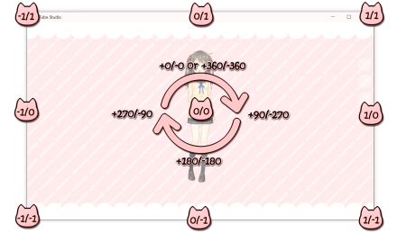

# TP_VTS

This is a plugin for using Vtube Studio with Touch Portal

## Installation

Grap the latest release of TP_VTS from [releases](https://github.com/Wiccy84/TP_VTS/releases).
In Touch Portal click on the cog in the top right, then click on plug-ins on the left. Now click on Import plug-in and navigate to where you downloaded TP_VTS.tpp and click open and then OK. You should now see a warning that you have installed a plugin that you have not trusted yet click Trust Always to not get the warning again or Ok to pass the warning once. Clicking No will not allow the plugin to work.

If it is not already loaded, load Vtube Studio. Once loaded the plugin should attempt to connect to VTS the first time it does this you will get a pop up asking you if you would like to let the plugin access VTS. If this does not happen open the settings of VTS and make sure the API is on and the port is set to 8001. Once you see the pop up click allow and the authentication key will be saved for next loads. You can revoke this permissions anytime in VTS by going into the settings and clicking on remove plugins and selecting "Touch Portal - VTS Plugin" and clicking select.

## Usage

Currently this plugin adds six actions to Touch portal for use with VTS.

**Load Model** -  on load of Touch Portal and connection to VTS this is populated with a list of all models currently accessable to VTS. Use the drop down list to select a model to load. (This list currently can only be updated by stop/start the plugin or restarting TP itself.)

**Move Model** -  This action is to move your model around! There are six paramaters for this action
* Time(s)
  * Time to travel in seconds from origin to the paramaters you input. min = 0, max = 2, **Example Time(s) 0.5.**
* Reletive
  * If movement is done from 0,0 or from where the model currently is. True is from 0,0 and False is from models current posistion.
* X
  * This is the movement of the left and right plane. A negitive number will go left and a positive number will go right. -1 and 1 are the edges of the screen but you can input a max of -1000, 1000. **Example X 0.5**
* Y
  * This is the movement of the up and down plane. A negitive number will go down and a positive number will go up. -1 and 1 are the edges of the screen but you can input a max of -1000, 1000. **Example Y -0.2**
* Rotation
  * For Rotating your model negitive number will turn counter clockwise and positive will go clockwise. min = -360, max = 360, **Example Rotation -90**
* Size
  * The size of your model displayed. A negitive number will make smaller and a positive number will make larger. min = -100, max = 100, **Example Rotation -75**

**Run Hotkey**

**Tint All Art Mesh**

**Tint Art Mesh**

**Display Model Data**

